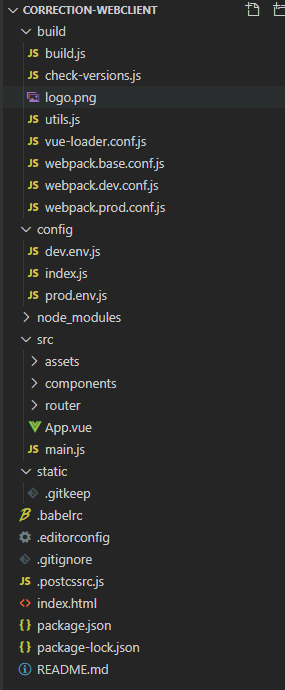

# 预警报订正系统 前端工程

# 一. 工程启动流程说明：

## 1. 安装
```
1.控制台默认目录下依次安装nodejs，npm(新版nodejs自带)，cnpm, vue-cil：
　　1.1 nodejs下载地址为：https://nodejs.org/en/
　　1.2 检查是否安装成功：分别输入node -v，npm -v,  如果输出版本号，说明我们安装node环境成功
    1.3 安装cnpm,命令如下: npm install -g cnpm --registry=https://registry.npm.taobao.org
        输入cnpm -v检查是否安装成功了
    1.4 安装vue脚手架工程，命令如下：npm install --global vue-cli
    1.5 安装webpack,命令如下：npm install -g webpack
```
### 2. 初始化工程
```
在VSCODE中打开correction-webclient文件夹，然后在菜单栏选择Terminal，在终端中输入以下命令：
npm install （如果速度问题可以使用cnpm）
```
### 3. 启动
```
在终端中输入以下命令：
npm run serve
如在浏览器出现VUE的log及Welcome to Your Vue.js App的字样 则说明成功
```
# 二. 工程目录说明：

## 1. 工程目录结构


## 2. 目录说明
```
2.1、build：构建脚本目录

　　　　1）build.js   ==>  生产环境构建脚本；

　　　　2）check-versions.js   ==>  检查npm，node.js版本；

　　　　3）utils.js   ==>  构建相关工具方法；

　　　　4）vue-loader.conf.js   ==>  配置了css加载器以及编译css之后自动添加前缀；

　　　　5）webpack.base.conf.js   ==>  webpack基本配置；

　　　　6）webpack.dev.conf.js   ==>  webpack开发环境配置；

　　　　7）webpack.prod.conf.js   ==>  webpack生产环境配置；

　　2.2、config：项目配置

　　　　1）dev.env.js   ==>  开发环境变量；

　　　　2）index.js   ==>  项目配置文件；

　　　　3）prod.env.js   ==>  生产环境变量；

　　2.3、node_modules：npm 加载的项目依赖模块

　　2.4、src：这里是我们要开发的目录，基本上要做的事情都在这个目录里。里面包含了几个目录及文件：

　　　　1）assets：资源目录，放置一些图片或者公共js、公共css。这里的资源会被webpack构建；

　　　　2）components：组件目录，我们写的组件就放在这个目录里面；

　　　　3）router：前端路由，我们需要配置的路由路径写在index.js里面；

　　　　4）App.vue：根组件；

　　　　5）main.js：入口js文件；

　　2.5、static：静态资源目录，如图片、字体等。不会被webpack构建

　　2.6、index.html：首页入口文件，可以添加一些 meta 信息等

　　2.7、package.json：npm包配置文件，定义了项目的npm脚本，依赖包等信息

　　2.8、README.md：项目的说明文档，markdown 格式

　　2.9、.xxxx文件：这些是一些配置文件，包括语法配置，git配置等
  ```
